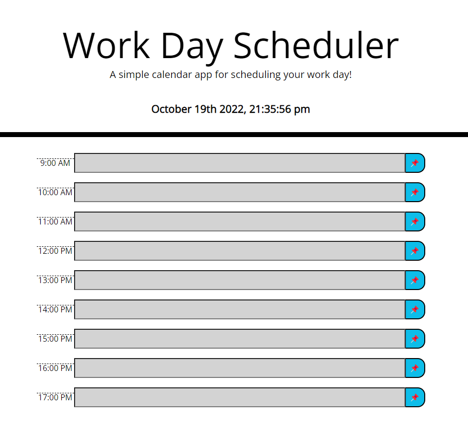

# 05 Third-Party APIs: Work Day Scheduler

## Description

This application is a simple daily calendar for week 5's challenge in the coding bootcamp. It applies the JavaScript principles of third-party APIs learned that week.

## Installation

Clone this Repo

## Usage

To use this application, visit the URL below. To enter a calendar event, click on the form under the preferred hour, then type that hour's activity. To save the entry to your browser's local storage and persist the item to the form even after page close or refresh, click the save icon on the right of the form field. 

Each past hour will display grey, the current hour will display red, and any future hour will display green. 

* The URL of the deployed application: https://benmday.github.io/challenge-week-5/

* The URL of the GitHub repository: https://github.com/benmday/challenge-week-5

- - -
